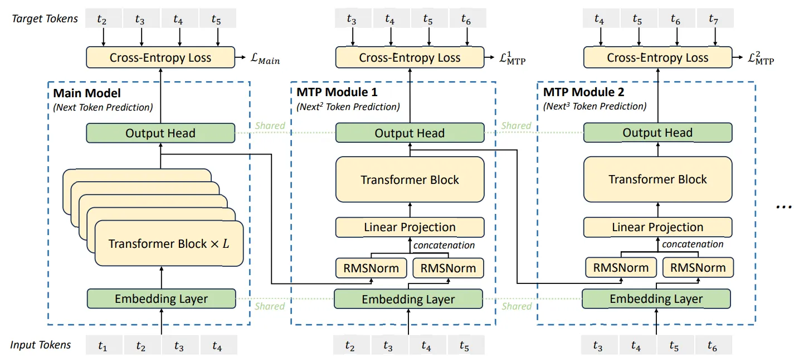

我被拉去排查 DeepSeek MTP 接受率低的问题，排查了一个星期，踩内存、精度、采样算法都怀疑过，但没找到问题。最后比对 GPU dump 的数据发现 tensor shape 对不上，这才知道是模型结构问题。

之前我对 MTP 的理解来自 [DeepSeek-V3 技术报告](https://arxiv.org/abs/2412.19437) 的这张图：

这图的 MTP Module 2 底下的 $t_3 t_4 t_5 t_6$ 作为输入（正确的结构只有 $t_6$），导致我认为 MTP Module 2 是一个独立的模块，拥有独立的 KVCache。

正确的结构是 MTP Module 1 做完后再往下吐一个 token。

太坑了，看来不能只看一张图就草率下结论。
